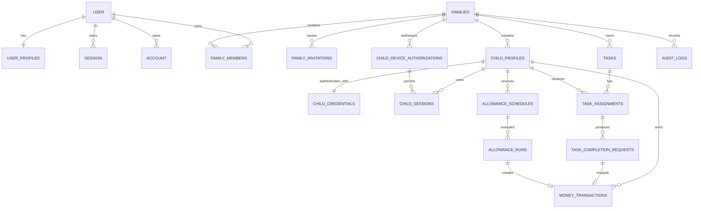

# Kinder Tasks: arquitectura y plan del MVP

## 1. MVP definitivo

Kinder Tasks será una PWA familiar multi-tenant donde cada `family` constituye la frontera principal de datos y autorización.

El MVP incluirá:

- Registro, verificación, inicio de sesión y recuperación de cuentas adultas.
- Varias familias por cuenta adulta.
- Varios padres por familia mediante invitaciones verificadas.
- Perfiles infantiles sin correo, protegidos por PIN.
- Dispositivos infantiles autorizados previamente por un padre.
- Pagas semanales y mensuales en EUR.
- Tareas puntuales, recurrentes y abiertas.
- Asignación independiente a varios hijos.
- Solicitud, aprobación y rechazo de realizaciones.
- Libro mayor inmutable, con saldo calculado desde movimientos.
- Retiradas sin posibilidad de saldo negativo.
- Procesamiento idempotente de pagas y recompensas.
- PWA instalable con consulta offline limitada.
- Cola offline para solicitudes de finalización.
- Área básica y separada de superadministración.
- Exportación y eliminación diferida de datos.
- Auditoría de acciones sensibles.
- Interfaz en español preparada para internacionalización.

No se incluirán capacidades expresamente excluidas, como OAuth social, push, chat, pagos reales, tareas competitivas, fotos, avatares personalizados o gamificación avanzada.

## 2. Interpretación del producto

La aplicación no representa dinero bancario ni ejecuta pagos. Mantiene un registro familiar de dinero virtual adeudado o reservado para cada menor.

Las reglas centrales serán:

- Una familia es un tenant aislado.
- Un adulto puede administrar varias familias.
- Un hijo solo pertenece a una familia.
- El PIN genera una identidad infantil limitada, diferente de Better Auth.
- El saldo siempre se deriva del libro de movimientos.
- Completar una tarea no paga automáticamente.
- Solo una aprobación adulta puede generar la recompensa.
- Las pagas y recompensas son operaciones idempotentes.
- La disponibilidad de tareas se calcula a partir de asignaciones, configuración y periodos.
- Los identificadores recibidos del navegador nunca conceden autorización.
- Toda operación económica o administrativa sensible se ejecuta en el servidor.

## 3. Suposiciones

- Se utilizará `pnpm`.
- Los identificadores serán UUIDv7 generados en el servidor. Los identificadores offline serán UUID criptográficamente seguros generados con `crypto.randomUUID()`.
- Los timestamps se guardarán como enteros Unix en milisegundos UTC.
- Las fechas de calendario, como `start_date`, se guardarán además como `TEXT` con formato `YYYY-MM-DD`.
- La moneda de una familia será fija en EUR durante el MVP.
- La zona horaria predeterminada será `Europe/Madrid`.
- Una paga vence al comienzo del día local configurado.
- La tarea conserva una recompensa actual, pero cada solicitud guarda una copia de esa recompensa.
- Las tareas y perfiles se desactivarán mediante borrado lógico durante el uso normal.
- La eliminación de una familia tendrá 30 días de recuperación antes del purgado definitivo.
- Las invitaciones expirarán a los 7 días.
- Las sesiones infantiles normales expirarán tras 30 días, con renovación limitada y revocación explícita.
- El enlace de invitación se mostrará en desarrollo si no hay proveedor de correo.
- TanStack Query no se incorporará inicialmente. Loaders, actions, fetchers e IndexedDB cubren el MVP sin duplicar estado.
- La primera cuenta superadministradora se configurará mediante un script seguro ejecutado fuera del frontend público.
- Los alias infantiles no serán globalmente únicos; solo deben distinguirse visualmente dentro de una familia.
- Los datos offline estarán desactivados por defecto y requerirán autorización del dispositivo.

## 4. Decisiones confirmadas

### Acceso infantil

Se utilizará el modelo de **dispositivo autorizado**:

1. Un padre autenticado activa el modo infantil.
2. El servidor crea una autorización revocable para ese dispositivo y familia.
3. El dispositivo puede mostrar los perfiles activos de esa familia.
4. El menor selecciona su perfil e introduce su PIN.
5. El servidor valida dispositivo, familia, perfil, PIN y bloqueo.
6. Se crea una sesión infantil vinculada de forma inmutable al hijo y la familia.

Conocer una URL o un `childId` no permitirá iniciar sesión.

### Persistencia offline

Será **opt-in por dispositivo**:

- Por defecto, la información infantil no persistirá para uso offline.
- Un padre podrá habilitar "Recordar datos en este dispositivo".
- La interfaz advertirá de que saldo, tareas e historial quedarán disponibles localmente.
- La revocación online invalidará futuras sincronizaciones.
- El cierre completo del modo infantil borrará los datos locales.
- No se almacenarán PIN, hash de PIN, cookies o tokens en IndexedDB ni Cache Storage.

## 5. Riesgos y tensiones técnicas

### SQLite no tiene RLS

Toda consulta deberá recibir un contexto autorizado construido desde la sesión. Se reforzará con:

- Servicios server-only.
- Filtros obligatorios por `family_id`.
- Claves foráneas y restricciones compuestas.
- Pruebas horizontales y verticales.
- Política de denegación por defecto.

### Saldo no negativo y concurrencia

Calcular el saldo y registrar una retirada son dos pasos que podrían competir. La operación se realizará dentro de una transacción SQLite con bloqueo de escritura y validación inmediatamente anterior al `INSERT`.

La compatibilidad transaccional concreta del cliente Turso/LibSQL se verificará con una prueba de integración real, no solo con SQLite local.

### Scheduled Functions

Las Scheduled Functions de Netlify tienen un límite actual de 30 segundos. La función:

- Procesará lotes pequeños.
- Tendrá un presupuesto temporal.
- Ordenará por `next_run_at`.
- Podrá dejar trabajo para la siguiente ejecución.
- Se complementará con procesamiento diferido durante accesos adultos.

Para un volumen elevado sería necesario evolucionar a una función background o cola, pero no forma parte del MVP.

### Offline y privacidad

No es posible revocar instantáneamente datos que ya se encuentran en un dispositivo desconectado. Por eso:

- La persistencia será voluntaria.
- Se mostrarán datos mínimos.
- Se aplicará caducidad local.
- Se borrarán en logout y revocación cuando el dispositivo vuelva a conectarse.
- Nunca se cachearán respuestas autenticadas mediante reglas generales del service worker.

### Estado `available`

`available` será un estado derivado, no una fila precreada:

- Una asignación está disponible cuando la configuración permite una nueva realización en el periodo.
- Al enviarse, se crea una solicitud en `pending_approval`.
- Esto evita generar anticipadamente millones de realizaciones recurrentes.

### Libro inmutable y RGPD

Los movimientos económicos no se editarán. Durante una eliminación:

- Primero se desactivará la familia.
- Después se anonimizarán referencias personales.
- Finalmente se purgarán los datos privados tras el periodo definido.
- Solo se conservarán eventos técnicos legalmente necesarios y sin identidad infantil directa.

No quedan preguntas bloqueantes tras elegir dispositivo autorizado y offline opt-in.

## 6. Arquitectura

Se utilizará un monolito modular full-stack. React Router será la capa HTTP y de navegación, no la capa de dominio.

```text
app/
  components/
    ui/
    layout/
    feedback/
  features/
    auth/
    families/
    children/
    allowances/
    tasks/
    wallet/
    invitations/
    admin/
    privacy/
  hooks/
  lib/
    auth/
    db/
    i18n/
    offline/
    security/
    observability/
  routes/
    public/
    parent/
    child/
    admin/
    api/
  domain/
    allowances/
    tasks/
    wallet/
    invitations/
  services/
    auth/
    authorization/
    repositories/
    email/
    audit/
    rate-limit/
    privacy/
  schemas/
  types/
  root.tsx
  routes.ts

drizzle/
  schema/
  migrations/
  seed/

netlify/
  functions/
    process-allowances.ts

public/
  icons/
  manifest assets/

tests/
  unit/
  integration/
  e2e/
  fixtures/
```

### Responsabilidades

| Capa | Responsabilidad |
|---|---|
| Routes | Loaders, actions, parsing HTTP y composición de respuestas |
| Schemas | Validación Zod en límites de entrada |
| Authorization | Construcción y validación del contexto autorizado |
| Domain | Reglas puras de pagas, periodos, tareas y dinero |
| Services | Casos de uso y transacciones |
| Repositories | Consultas Drizzle limitadas por tenant |
| Components | Presentación, accesibilidad e interacción |
| Offline | IndexedDB, cola, sincronización y estado de conectividad |
| Infrastructure | Turso, Better Auth, Netlify y correo |

Los módulos del navegador no podrán importar `*.server.ts`.

## 7. Flujo de datos

### Lecturas

1. El loader obtiene la sesión desde la cookie.
2. Construye `ParentContext`, `ChildContext` o `AdminContext`.
3. Valida membresía y estado.
4. Invoca un caso de uso.
5. El repositorio aplica `family_id` y demás filtros autorizados.
6. El loader devuelve únicamente un DTO mínimo.

### Mutaciones

1. La action valida método, origen y CSRF.
2. Obtiene la identidad exclusivamente de la sesión.
3. Valida el payload con Zod.
4. Ejecuta autorización server-side.
5. Ejecuta el caso de uso y su transacción.
6. Registra auditoría si corresponde.
7. Devuelve un resultado público sin detalles internos.

## 8. Despliegue en Netlify

Se partirá de la plantilla oficial de React Router para Netlify y se utilizará:

- `@netlify/vite-plugin-react-router`.
- Netlify Serverless Functions con runtime Node.js.
- Una función SSR generada para React Router.
- Una Scheduled Function independiente para pagas.
- Turso como base de datos remota.
- Migraciones ejecutadas explícitamente durante el proceso de release, no en cada arranque.

### Variables de entorno

- `TURSO_DATABASE_URL`
- `TURSO_AUTH_TOKEN`
- `BETTER_AUTH_SECRET`
- `APP_URL`
- `EMAIL_PROVIDER`
- `RESEND_API_KEY` y `EMAIL_FROM` cuando se utiliza Resend
- `SUPERADMIN_EMAILS`, para aprovisionamiento controlado de cuentas verificadas
- Secretos para tareas internas, si finalmente son necesarios

Solo variables expresamente públicas llevarán prefijo de Vite.

### Entornos

- Desarrollo: Turso o SQLite de pruebas separado.
- Deploy Preview: base aislada o rama de Turso, sin cron automático.
- Producción: base y secretos de producción.
- Tests: SQLite/libSQL efímero y una suite adicional contra Turso.

### Scheduled Function

- Ejecución diaria, después de medianoche en `Europe/Madrid`.
- Cron expresado en UTC.
- Selección por `active = 1 AND next_run_at <= now`.
- Lotes, por ejemplo, de 50 registros.
- Servicio de dominio compartido con la comprobación diferida.
- Parada antes de consumir el límite máximo.
- Logs estructurados con conteos, no información infantil.

## 9. Modelo de datos

### Convenciones

- `TEXT` para UUID, emails normalizados, enums y fechas locales.
- `INTEGER` para timestamps UTC, booleanos y dinero.
- Booleanos restringidos con `CHECK (value IN (0,1))`.
- Todos los importes son enteros.
- Tablas del tenant incluyen `family_id`.
- Las tablas mutables incluyen `created_at` y `updated_at`.
- Auditoría y movimientos son append-only.
- El borrado lógico es la operación normal.
- El borrado físico ocurre solo durante el purgado de una familia.

### Better Auth

El esquema final se generará con la versión fijada de Better Auth y su adaptador Drizzle. La migración generada será revisada y versionada.

| Tabla | Columnas principales |
|---|---|
| `user` | `id TEXT PK`, `name TEXT`, `email TEXT UNIQUE NOT NULL`, `email_verified INTEGER NOT NULL`, `image TEXT`, `created_at INTEGER`, `updated_at INTEGER` |
| `session` | `id TEXT PK`, `user_id TEXT FK`, `token TEXT UNIQUE`, `expires_at INTEGER`, `ip_address TEXT`, `user_agent TEXT`, timestamps |
| `account` | `id TEXT PK`, `user_id TEXT FK`, `account_id TEXT`, `provider_id TEXT`, credenciales y tokens gestionados por Better Auth, timestamps |
| `verification` | `id TEXT PK`, `identifier TEXT`, `value TEXT`, `expires_at INTEGER`, timestamps |

Políticas:

- Las contraseñas solo existen como hashes administrados por Better Auth.
- `session`, `account` y `verification` se eliminan con su usuario.
- Los tokens de verificación no se registran en logs.
- Los nombres exactos se mantendrán compatibles con el adaptador, evitando personalizaciones innecesarias.

### `user_profiles`

Perfil operativo separado de autenticación.

Columnas:

- `user_id TEXT PK FK user(id)`
- `global_role TEXT NOT NULL CHECK ('user','superadmin')`
- `status TEXT NOT NULL CHECK ('active','blocked','pending_deletion','deleted')`
- `locale TEXT NOT NULL DEFAULT 'es'`
- `blocked_at INTEGER NULL`
- `blocked_reason TEXT NULL`
- `deleted_at INTEGER NULL`
- `created_at`, `updated_at`

Índices: `status`, `global_role`.

Borrado: `CASCADE` al purgar el usuario. En el flujo normal se anonimiza antes.

### `families`

Columnas:

- `id TEXT PK`
- `name TEXT NOT NULL`
- `currency TEXT NOT NULL DEFAULT 'EUR' CHECK (currency = 'EUR')`
- `timezone TEXT NOT NULL DEFAULT 'Europe/Madrid'`
- `status TEXT NOT NULL CHECK ('active','disabled','pending_deletion','deleted')`
- `created_by_user_id TEXT NULL FK user(id)`
- `deletion_requested_at INTEGER NULL`
- `purge_after INTEGER NULL`
- `created_at`, `updated_at`

Índices: `status`, `created_by_user_id`.

Borrado: usuario creador `SET NULL`; datos familiares se purgan en cascada después del periodo de recuperación.

### `family_members`

Columnas:

- `id TEXT PK`
- `family_id TEXT NOT NULL FK families(id)`
- `user_id TEXT NOT NULL FK user(id)`
- `role TEXT NOT NULL CHECK (role = 'parent')`
- `status TEXT NOT NULL CHECK ('active','suspended','left')`
- `joined_at INTEGER NOT NULL`
- `created_at`, `updated_at`
- `UNIQUE(family_id, user_id)`

Índices: `(family_id, status)`, `(user_id, status)`.

Borrado: familia `CASCADE`; usuario `RESTRICT` hasta completar salida o anonimización.

### `family_invitations`

Columnas:

- `id TEXT PK`
- `family_id TEXT NOT NULL`
- `email_normalized TEXT NOT NULL`
- `token_hash TEXT NOT NULL UNIQUE`
- `status TEXT NOT NULL CHECK ('pending','accepted','revoked','expired')`
- `invited_by_user_id TEXT NULL`
- `accepted_by_user_id TEXT NULL`
- `expires_at INTEGER NOT NULL`
- `accepted_at INTEGER NULL`
- `revoked_at INTEGER NULL`
- `created_at`, `updated_at`

Restricciones:

- Índice parcial único para una invitación pendiente por familia y email.
- Aceptación solo si el email autenticado coincide.

Índices: `(email_normalized, status)`, `(family_id, status)`, `expires_at`.

Borrado: familia `CASCADE`; usuarios `SET NULL`.

### `child_profiles`

Columnas:

- `id TEXT PK`
- `family_id TEXT NOT NULL`
- `alias TEXT NOT NULL`
- `avatar_key TEXT NOT NULL`
- `profile_color TEXT NOT NULL`
- `status TEXT NOT NULL CHECK ('active','disabled','pending_deletion')`
- `deleted_at INTEGER NULL`
- `created_at`, `updated_at`

Índices: `(family_id, status)`.

Restricciones: avatar y color deben pertenecer a listas permitidas validadas también con Zod.

Borrado: familia `CASCADE`.

### `child_credentials`

Columnas:

- `child_id TEXT PK`
- `family_id TEXT NOT NULL`
- `pin_hash TEXT NOT NULL`
- `failed_attempts INTEGER NOT NULL DEFAULT 0 CHECK (failed_attempts >= 0)`
- `locked_until INTEGER NULL`
- `last_failed_at INTEGER NULL`
- `pin_changed_at INTEGER NOT NULL`
- `created_at`, `updated_at`

Relación: uno a uno con `child_profiles`.

Borrado: hijo `CASCADE`.

### `child_device_authorizations`

Columnas:

- `id TEXT PK`
- `family_id TEXT NOT NULL`
- `token_hash TEXT NOT NULL UNIQUE`
- `name TEXT NULL`
- `offline_enabled INTEGER NOT NULL DEFAULT 0`
- `expires_at INTEGER NOT NULL`
- `last_used_at INTEGER NULL`
- `revoked_at INTEGER NULL`
- `authorized_by_user_id TEXT NULL`
- `created_at`, `updated_at`

Índices: `(family_id, revoked_at)`, `expires_at`.

Borrado: familia `CASCADE`; autorizador `SET NULL`.

### `child_sessions`

Columnas:

- `id TEXT PK`
- `family_id TEXT NOT NULL`
- `child_id TEXT NOT NULL`
- `device_authorization_id TEXT NOT NULL`
- `token_hash TEXT NOT NULL UNIQUE`
- `csrf_secret_hash TEXT NOT NULL`
- `expires_at INTEGER NOT NULL`
- `last_seen_at INTEGER`
- `revoked_at INTEGER NULL`
- `created_at`, `updated_at`

Índices: `(child_id, revoked_at)`, `expires_at`.

Borrado: hijo o dispositivo `CASCADE`.

### `allowance_schedules`

Columnas:

- `id TEXT PK`
- `family_id TEXT NOT NULL`
- `child_id TEXT NOT NULL`
- `amount_cents INTEGER NOT NULL CHECK (amount_cents > 0)`
- `currency TEXT NOT NULL CHECK (currency = 'EUR')`
- `frequency TEXT NOT NULL CHECK ('weekly','monthly')`
- `weekday INTEGER NULL CHECK (weekday BETWEEN 1 AND 7)`
- `month_day INTEGER NULL CHECK (month_day BETWEEN 1 AND 31)`
- `timezone TEXT NOT NULL`
- `start_date TEXT NOT NULL`
- `end_date TEXT NULL`
- `next_run_at INTEGER NOT NULL`
- `last_run_at INTEGER NULL`
- `status TEXT NOT NULL CHECK ('active','paused','ended')`
- `created_at`, `updated_at`

Restricciones:

- Semanal requiere `weekday` y prohíbe `month_day`.
- Mensual requiere `month_day` y prohíbe `weekday`.
- Índice parcial único para una paga activa por hijo.

Índices: `(status, next_run_at)`, `(family_id, child_id)`.

Borrado: hijo o familia `CASCADE` durante purgado; durante uso normal se pausa.

### `allowance_runs`

Registro idempotente de ejecuciones.

Columnas:

- `id TEXT PK`
- `family_id TEXT NOT NULL`
- `allowance_schedule_id TEXT NOT NULL`
- `period_key TEXT NOT NULL`
- `due_at INTEGER NOT NULL`
- `amount_cents INTEGER NOT NULL`
- `status TEXT NOT NULL CHECK ('processing','completed','failed')`
- `money_transaction_id TEXT NULL`
- `error_code TEXT NULL`
- `created_at`, `updated_at`
- `UNIQUE(allowance_schedule_id, period_key)`

Índices: `(status, due_at)`, `(family_id, created_at)`.

Borrado: familia `CASCADE`; schedule `RESTRICT` mientras exista la familia.

### `tasks`

Columnas:

- `id TEXT PK`
- `family_id TEXT NOT NULL`
- `title TEXT NOT NULL`
- `description TEXT NULL`
- `type TEXT NOT NULL CHECK ('one_off','recurring','open')`
- `status TEXT NOT NULL CHECK ('active','paused','archived')`
- `reward_cents INTEGER NOT NULL CHECK (reward_cents >= 0)`
- `currency TEXT NOT NULL CHECK (currency = 'EUR')`
- `recurrence_unit TEXT NULL CHECK ('daily','weekly','monthly')`
- `recurrence_interval INTEGER NULL CHECK (recurrence_interval > 0)`
- `recurrence_weekday INTEGER NULL`
- `recurrence_month_day INTEGER NULL`
- `open_limit_count INTEGER NULL CHECK (open_limit_count > 0)`
- `open_limit_period TEXT NULL CHECK ('day','week','month')`
- `starts_at INTEGER NULL`
- `ends_at INTEGER NULL`
- `created_by_user_id TEXT NULL`
- `created_at`, `updated_at`

Checks cruzados diferenciarán la configuración permitida por tipo.

Índices: `(family_id, status)`, `(family_id, type, status)`.

Borrado: familia `CASCADE`; creador `SET NULL`; borrado normal mediante `archived`.

### `task_assignments`

Columnas:

- `id TEXT PK`
- `family_id TEXT NOT NULL`
- `task_id TEXT NOT NULL`
- `child_id TEXT NOT NULL`
- `status TEXT NOT NULL CHECK ('active','paused','removed')`
- `assigned_at INTEGER NOT NULL`
- `created_at`, `updated_at`
- `UNIQUE(task_id, child_id)`

Índices: `(task_id, child_id)`, `(child_id, status)`.

Borrado: tarea o hijo `CASCADE` durante el purgado.

### `task_completion_requests`

Columnas:

- `id TEXT PK`
- `family_id TEXT NOT NULL`
- `task_id TEXT NOT NULL`
- `assignment_id TEXT NOT NULL`
- `child_id TEXT NOT NULL`
- `period_key TEXT NOT NULL`
- `occurrence_number INTEGER NOT NULL DEFAULT 1 CHECK (occurrence_number > 0)`
- `client_request_id TEXT NOT NULL UNIQUE`
- `status TEXT NOT NULL CHECK ('pending_approval','approved','rejected','cancelled')`
- `reward_cents_snapshot INTEGER NOT NULL CHECK (reward_cents_snapshot >= 0)`
- `currency TEXT NOT NULL CHECK (currency = 'EUR')`
- `requested_at INTEGER NOT NULL`
- `reviewed_at INTEGER NULL`
- `reviewed_by_user_id TEXT NULL`
- `rejection_reason TEXT NULL`
- `created_at`, `updated_at`
- `UNIQUE(task_id, child_id, period_key, occurrence_number)`

Índices:

- `(child_id, status, requested_at)`
- `(family_id, status, requested_at)`
- `(task_id, period_key)`

Borrado: referencias de dominio `RESTRICT` durante uso; familia `CASCADE` en purgado.

### `money_transactions`

Columnas:

- `id TEXT PK`
- `family_id TEXT NOT NULL`
- `child_id TEXT NOT NULL`
- `amount_cents INTEGER NOT NULL CHECK (amount_cents != 0)`
- `currency TEXT NOT NULL CHECK (currency = 'EUR')`
- `type TEXT NOT NULL`
- `description TEXT NOT NULL`
- `created_by_kind TEXT NOT NULL CHECK ('user','system')`
- `created_by_user_id TEXT NULL`
- `task_id TEXT NULL`
- `task_completion_request_id TEXT NULL`
- `allowance_schedule_id TEXT NULL`
- `idempotency_key TEXT NOT NULL UNIQUE`
- `effective_at INTEGER NOT NULL`
- `created_at`, `updated_at`

Checks:

- Créditos deben ser positivos.
- `withdrawal` y `correction_debit` deben ser negativos.
- `task_reward` requiere solicitud.
- `allowance` requiere paga.
- `created_by_user_id` es obligatorio cuando el creador es `user`.

Índices:

- `(child_id, effective_at DESC)`
- `(family_id, effective_at DESC)`
- `(task_completion_request_id)`
- `(allowance_schedule_id)`

Los `UPDATE` y `DELETE` no se expondrán en repositorios de aplicación.

### `audit_logs`

Columnas:

- `id TEXT PK`
- `family_id TEXT NULL`
- `actor_type TEXT NOT NULL CHECK ('user','child','system','superadmin')`
- `actor_user_id TEXT NULL`
- `actor_child_id TEXT NULL`
- `action TEXT NOT NULL`
- `target_type TEXT NOT NULL`
- `target_id TEXT NULL`
- `result TEXT NOT NULL CHECK ('success','denied','failure')`
- `metadata_json TEXT NULL`
- `ip_hash TEXT NULL`
- `request_id TEXT NULL`
- `created_at INTEGER NOT NULL`
- `updated_at INTEGER NOT NULL`

Índices:

- `(family_id, created_at DESC)`
- `(actor_user_id, created_at DESC)`
- `(action, created_at DESC)`
- `(result, created_at DESC)`

Será append-only. Los metadatos usarán listas permitidas, no payloads completos.

### `rate_limit_buckets`

Persistencia compartida para límites sensibles.

Columnas:

- `key_hash TEXT PK`
- `scope TEXT NOT NULL`
- `attempt_count INTEGER NOT NULL`
- `window_started_at INTEGER NOT NULL`
- `blocked_until INTEGER NULL`
- `expires_at INTEGER NOT NULL`
- `created_at`, `updated_at`

No contendrá emails, PIN ni IP en claro.

## 10. Diagrama de relaciones



Las relaciones entre entidades familiares se reforzarán con `family_id` y, cuando corresponda, claves compuestas para impedir referencias cruzadas entre tenants.

## 11. Autenticación infantil

### Hash

Se empleará Argon2id, con parámetros ajustados al runtime serverless y revisados mediante benchmark. El PIN nunca llegará a logs ni se devolverá al cliente.

Aunque un PIN tenga poca entropía, un hash costoso reduce el impacto de una filtración, pero no sustituye el rate limiting.

### Limitación de intentos

- Contador por credencial infantil.
- Límite adicional por dispositivo e IP hasheada.
- Bloqueo progresivo.
- Respuesta pública uniforme.
- Reinicio del contador tras autenticación correcta.
- Auditoría de bloqueos sin registrar el PIN.

Política inicial propuesta:

- 5 intentos fallidos: bloqueo de 5 minutos.
- Nuevos fallos: 15 minutos y después 1 hora.
- El padre puede restablecer PIN y desbloqueo.
- Rate limit adicional para evitar probar múltiples perfiles.

### Sesión

- Token aleatorio de alta entropía.
- Solo se guarda su hash en base de datos.
- Cookie `HttpOnly`, `Secure`, `SameSite=Lax`, `Path=/`.
- Cookie infantil separada de Better Auth.
- CSRF ligado a la sesión.
- Rotación periódica.
- Revocación al cambiar PIN, desactivar el perfil o revocar el dispositivo.

Las rutas infantiles nunca aceptarán `childId` para decidir el sujeto. Se obtendrá desde la sesión.

## 12. Autorización server-side

Se definirán tres contextos incompatibles:

- `ParentContext`: `userId`, familias activas y membresía validada.
- `ChildContext`: `childId`, `familyId`, `sessionId`, `deviceId`.
- `AdminContext`: `userId`, rol global y estado de cuenta.

Funciones centrales:

- `requireParentSession()`
- `requireFamilyParent(familyId)`
- `requireChildSession()`
- `requireSuperadmin()`
- `assertFamilyActive()`
- `denyAndAudit()`

Reglas:

- Un endpoint de padre no acepta una sesión infantil.
- Un endpoint infantil no puede transformarse en padre mediante un payload.
- `familyId` sirve para localizar una familia, pero la membresía decide el acceso.
- `childId` solo puede usarse tras comprobar que pertenece a la familia autorizada.
- Las queries no se ejecutan antes de completar la autorización.
- Las operaciones administrativas requieren comprobación explícita en cada action.
- Los loaders no devolverán hashes, tokens, emails innecesarios ni referencias internas.

## 13. Libro de movimientos

El saldo se calculará como:

```text
SUM(money_transactions.amount_cents)
```

No habrá un campo `balance` autoritativo.

Para mejorar rendimiento futuro se podría añadir una proyección reconstruible, pero el libro seguirá siendo la fuente de verdad.

### Retirada

1. Validar sesión adulta y familia.
2. Validar cantidad positiva en el formulario.
3. Convertirla en importe firmado negativo.
4. Abrir transacción.
5. Calcular saldo actual del hijo autorizado.
6. Rechazar si el resultado sería negativo.
7. Insertar movimiento.
8. Insertar auditoría.
9. Confirmar transacción.

### Correcciones

Un error nunca modifica el movimiento original. Se crea:

- `correction_credit`, o
- `correction_debit`.

La descripción y auditoría referenciarán el motivo, sin permitir borrar el historial.

## 14. Idempotencia

### Pagas

Cada vencimiento obtiene un `period_key` estable:

- Semanal: fecha local concreta de vencimiento, por ejemplo `2026-08-17`.
- Mensual: mes local, por ejemplo `2026-08`.

Claves:

```text
allowance:{scheduleId}:{periodKey}
```

La transacción:

1. Intenta crear `allowance_runs`.
2. La restricción única decide quién posee la ejecución.
3. Crea el movimiento con la misma clave idempotente.
4. Marca el run como completado.
5. Calcula el siguiente vencimiento.

Para el día 31 se utiliza el último día válido del mes. El cálculo se hará con una librería temporal compatible con zonas IANA o una utilidad de dominio probada exhaustivamente.

### Recompensas

Clave:

```text
task-reward:{completionRequestId}
```

La aprobación:

1. Obtiene la solicitud pendiente de la misma familia.
2. Abre una transacción.
3. Actualiza condicionalmente `pending_approval -> approved`.
4. Inserta el movimiento con clave única.
5. Registra auditoría.
6. Confirma todo conjuntamente.

Si la solicitud ya está aprobada, la repetición devuelve el resultado existente y no paga de nuevo.

### Solicitudes offline

`client_request_id` será único. Reenviar la misma solicitud devolverá la fila ya creada.

## 15. Rutas y pantallas

### Públicas

| Ruta | Pantalla |
|---|---|
| `/` | Inicio |
| `/register` | Registro |
| `/login` | Inicio de sesión |
| `/verify-email` | Verificación |
| `/forgot-password` | Recuperación |
| `/reset-password` | Restablecimiento |
| `/invite/:token` | Aceptación de invitación |
| `/privacy` | Privacidad |
| `/terms` | Términos |

### Padres

| Ruta | Pantalla |
|---|---|
| `/app` | Selector o redirección de familia |
| `/app/families` | Selector de familia |
| `/app/families/new` | Crear familia |
| `/app/:familyId` | Dashboard familiar |
| `/app/:familyId/children` | Hijos |
| `/app/:familyId/children/new` | Alta de hijo |
| `/app/:familyId/children/:childId` | Detalle |
| `/app/:familyId/children/:childId/edit` | Editar hijo |
| `/app/:familyId/children/:childId/wallet` | Saldo e historial |
| `/app/:familyId/children/:childId/allowance` | Paga |
| `/app/:familyId/tasks` | Tareas |
| `/app/:familyId/tasks/new` | Nueva tarea |
| `/app/:familyId/tasks/:taskId/edit` | Editar tarea |
| `/app/:familyId/requests` | Solicitudes pendientes |
| `/app/:familyId/withdrawals/new` | Retirada |
| `/app/:familyId/adjustments/new` | Ajuste |
| `/app/:familyId/members` | Miembros |
| `/app/:familyId/invitations` | Invitaciones |
| `/app/:familyId/settings` | Configuración familiar |
| `/app/:familyId/export` | Exportación |
| `/app/profile` | Perfil |
| `/app/security` | Contraseña y sesiones |

Los IDs de la URL se consideran entradas no confiables.

### Hijos

| Ruta | Pantalla |
|---|---|
| `/kids` | Selector autorizado |
| `/kids/unlock/:profileRef` | Introducción de PIN |
| `/kids/home` | Inicio infantil |
| `/kids/wallet` | Saldo |
| `/kids/history` | Historial |
| `/kids/tasks` | Tareas disponibles |
| `/kids/tasks/pending` | Pendientes y revisadas |
| `/kids/profile` | Alias, avatar y color |

Después de iniciar sesión, las rutas no incluyen `childId`.

### Administración

| Ruta | Pantalla |
|---|---|
| `/admin` | Dashboard global |
| `/admin/users` | Usuarios |
| `/admin/users/:userId` | Detalle |
| `/admin/families` | Familias |
| `/admin/families/:familyId` | Detalle limitado |
| `/admin/audit` | Auditoría |
| `/admin/settings` | Configuración global |

### Endpoints técnicos

- `/api/auth/*`: Better Auth.
- `/api/kids/session`: creación y cierre de sesión infantil.
- `/api/kids/sync`: sincronización idempotente offline.
- `/api/health`: estado técnico sin secretos.
- Las mutaciones ordinarias usarán preferentemente actions de React Router.

## 16. UX/UI

### Dirección visual

- Mobile-first.
- Navegación inferior para hijos y vista móvil adulta.
- Sidebar compacta en escritorio.
- Tipografía legible, formas suaves y color familiar sin estética excesivamente infantil.
- Tarjetas económicas con cantidad, origen, fecha y estado textual.
- Avatares ilustrados predefinidos.
- Modo claro, oscuro y preferencia del sistema.
- Estados representados con icono, texto y color.

### Accesibilidad

- WCAG 2.2 AA.
- Objetivos táctiles mínimos de 44x44 px.
- Foco visible.
- Navegación completa por teclado.
- Diálogos con gestión correcta del foco.
- Mensajes de error asociados a campos.
- Regiones `aria-live` para sincronización y guardado.
- Preferencia de movimiento reducido.
- Contraste validado en ambos temas.

### Internacionalización

Los componentes usarán claves como:

- `wallet.balance.title`
- `tasks.status.pendingApproval`
- `offline.pendingSync`
- `allowance.frequency.weekly`

Los textos de ejemplo estarán en catálogos españoles, no escritos directamente en componentes reutilizables.

## 17. Estrategia offline

Se utilizará `vite-plugin-pwa` con un service worker controlado.

### Cache Storage

Solo contendrá:

- Shell de aplicación.
- CSS, JavaScript, fuentes e iconos versionados.
- Página offline.

No contendrá:

- Respuestas de autenticación.
- Loaders con datos familiares.
- Cookies o tokens.
- Peticiones de mutación.

### IndexedDB

Con opt-in contendrá DTO mínimos:

- Último saldo confirmado y fecha de sincronización.
- Historial reciente.
- Tareas sincronizadas.
- Preferencias visuales.
- Cola de solicitudes pendientes.

Cada registro incluirá `familyId`, `childId`, versión de esquema y `syncedAt`.

### Cola

Estados locales:

- `queued`
- `syncing`
- `synced`
- `conflict`
- `failed`

Al recuperar conexión:

1. Se comprueba que la sesión infantil sigue siendo válida.
2. Se envían solicitudes por orden de creación.
3. El servidor deduplica mediante `client_request_id`.
4. Se actualiza el estado local.
5. No se modifica el saldo hasta la aprobación adulta.

No se confiará exclusivamente en Background Sync porque su soporte, especialmente en iOS, no es uniforme. También se sincronizará al recuperar `online`, enfocar la aplicación y pulsar "Reintentar".

## 18. RGPD y privacidad infantil

### Minimización

- Solo alias, avatar predefinido y color para menores.
- Sin apellidos, fecha de nacimiento, email, fotos o localización.
- Sin publicidad, tracking comercial o analítica de terceros.
- Los logs no incluirán títulos de tareas, alias ni descripciones financieras salvo necesidad operativa explícita.

### Derechos

- Exportación familiar en JSON y, si resulta útil, CSV para movimientos.
- Eliminación de cuenta.
- Eliminación diferida de familia.
- Revocación de sesiones y dispositivos.
- Registro de accesos excepcionales de soporte.

### Retención propuesta

- Invitaciones expiradas: purgado o anonimización tras 90 días.
- Sesiones revocadas: 30 días para seguridad.
- Rate limits: purgado automático al expirar.
- Logs técnicos: 90 días.
- Auditoría sensible: 12 meses, minimizada.
- Familia eliminada: recuperación durante 30 días y purgado posterior.

Estos periodos deberán reflejarse en la política de privacidad y podrán ajustarse antes de producción.

### Eliminación de adulto

- Revocar sesiones.
- Cancelar invitaciones pendientes creadas por esa persona.
- Eliminar membresías si quedan otros padres.
- Bloquear eliminación si es el único padre hasta transferir o eliminar la familia.
- Anonimizar referencias conservadas en auditoría.

### Eliminación de familia

- Marcar `pending_deletion`.
- Revocar sesiones y dispositivos infantiles.
- Pausar pagas y tareas.
- Impedir nuevas operaciones.
- Purgar datos privados tras 30 días.
- Conservar solo registros técnicos anonimizados estrictamente necesarios.

## 19. Seguridad

- Zod en formularios, actions, endpoints, variables de entorno y datos de sincronización.
- Better Auth para contraseñas y sesiones adultas.
- Argon2id para PIN.
- Protección CSRF mediante comprobación de `Origin`, cookies `SameSite` y token ligado a sesión.
- CSP inicialmente compatible con Vite/React y endurecida antes de producción.
- Cabeceras `X-Content-Type-Options`, `Referrer-Policy`, `Permissions-Policy` y protección de framing.
- Escape predeterminado de React; no se utilizará HTML arbitrario.
- Rate limiting persistente para login, registro, recuperación, PIN e invitaciones.
- Errores públicos con códigos estables y sin stack.
- Logs JSON estructurados y redactados.
- Confirmación reforzada para bloqueo, eliminación y operaciones administrativas.
- Ningún acceso directo del navegador a Turso.
- Ningún rol aceptado desde formularios.
- Tokens de invitación y sesión almacenados hasheados.
- Dependencias fijadas mediante lockfile y revisión de vulnerabilidades.

## 20. Estrategia de pruebas

### Unitarias con Vitest

- Cálculo de periodos semanales y mensuales.
- Día 31 y años bisiestos.
- Zonas horarias y cambios de horario.
- Disponibilidad de tareas.
- Límites diarios, semanales y mensuales.
- Transiciones de estado.
- Generación de claves idempotentes.
- Validación de importes y saldo.

### Integración

- Repositorios Drizzle.
- Servicios transaccionales.
- Better Auth.
- PIN, bloqueo y revocación.
- Invitaciones.
- Autorización entre familias.
- Aprobación atómica.
- Retiradas concurrentes.
- Procesamiento repetido de pagas.
- Sincronización offline repetida.
- Restricciones y claves únicas de SQLite.

Se añadirá una suite específica contra Turso para validar semántica transaccional real.

### Componentes

- Formularios accesibles.
- Errores Zod.
- Skeletons y estados vacíos.
- Confirmaciones destructivas.
- Indicadores offline.
- Navegación móvil y escritorio.

### E2E con Playwright

- Registro, verificación simulada y login.
- Creación de familia e hijo.
- Acceso por PIN y bloqueo.
- Invitación y aceptación.
- Tarea asignada a varios hijos.
- Solicitud, rechazo y aprobación.
- Segundo intento de aprobación.
- Paga y recompensa idempotentes.
- Retirada válida e inválida.
- Ataques horizontales y verticales.
- Restricción superadmin.
- Cola offline y reintento.
- Cierre y revocación de sesiones.
- Instalabilidad básica de la PWA.

## 21. Fases de implementación

### Fase 1: Base técnica

Objetivo:

- Crear React Router 7 con integración oficial de Netlify.
- Configurar TypeScript estricto, Tailwind, shadcn/ui, ESLint, Prettier, Vitest y Playwright.
- Configurar PWA mínima y catálogos i18n.
- Añadir layouts y componentes base accesibles.

Criterio de salida:

- Build, TypeScript, lint y pruebas base correctos.
- Aplicación instalable con shell offline.

### Fase 2: Persistencia y autenticación adulta

Objetivo:

- Definir esquema Drizzle.
- Configurar Turso y migraciones.
- Integrar Better Auth.
- Implementar registro, verificación, login, recuperación, sesiones y seguridad.
- Añadir adaptador de correo de desarrollo.

Criterio de salida:

- Flujos adultos críticos probados.
- Ningún secreto en el bundle.

### Fase 3: Familias, membresías e invitaciones

Objetivo:

- Crear familias y selector.
- Implementar contexto de autorización.
- Añadir invitaciones verificadas y auditoría.
- Probar aislamiento entre familias.

Criterio de salida:

- Acceso horizontal bloqueado y probado.

### Fase 4: Perfiles y sesiones infantiles

Objetivo:

- CRUD de hijos.
- PIN con Argon2id.
- Dispositivos autorizados.
- Bloqueos, restablecimiento y revocación.
- Interfaces infantiles separadas.

Criterio de salida:

- Un hijo no puede ejecutar ninguna operación adulta.

### Fase 5: Libro de movimientos y pagas

Objetivo:

- Libro inmutable.
- Saldo e historial.
- Retiradas y ajustes.
- Configuración de paga.
- Servicio idempotente y Scheduled Function.
- Comprobación diferida.

Criterio de salida:

- Pruebas de concurrencia, saldo negativo, día 31 e idempotencia correctas.

### Fase 6: Tareas

Objetivo:

- Tipos de tarea.
- Asignaciones múltiples.
- Disponibilidad por periodos.
- Solicitud infantil.
- Aprobación, rechazo y recompensa atómica.

Criterio de salida:

- No existen solicitudes o recompensas duplicadas bajo repetición o concurrencia.

### Fase 7: Offline y PWA completa

Objetivo:

- IndexedDB opt-in.
- Lecturas sincronizadas.
- Cola offline.
- Estados de conectividad.
- Limpieza y migración de cachés.

Criterio de salida:

- Reenvíos repetidos producen una sola solicitud.
- Ningún dato autenticado entra en caché pública.

### Fase 8: Administración, privacidad y endurecimiento

Objetivo:

- Panel superadmin.
- Bloqueos y desactivaciones.
- Exportación y eliminación.
- Retención y purgado.
- CSP, auditoría y pruebas E2E completas.

Criterio de salida:

- Todas las acciones administrativas están auditadas.
- Suite completa, build, lint y TypeScript correctos.

## 22. Verificación por fase

Cada fase deberá entregar:

- Objetivo y alcance cerrado.
- Lista de archivos creados y modificados.
- Migraciones completas.
- Datos de prueba realistas en español.
- Pruebas unitarias, integración y E2E pertinentes.
- Ejecución de `typecheck`, lint, tests y build.
- Instrucciones de verificación manual.
- Confirmación de que no quedan pruebas críticas fallando.

No se iniciará una fase posterior mientras la anterior no compile o mantenga fallos críticos.
